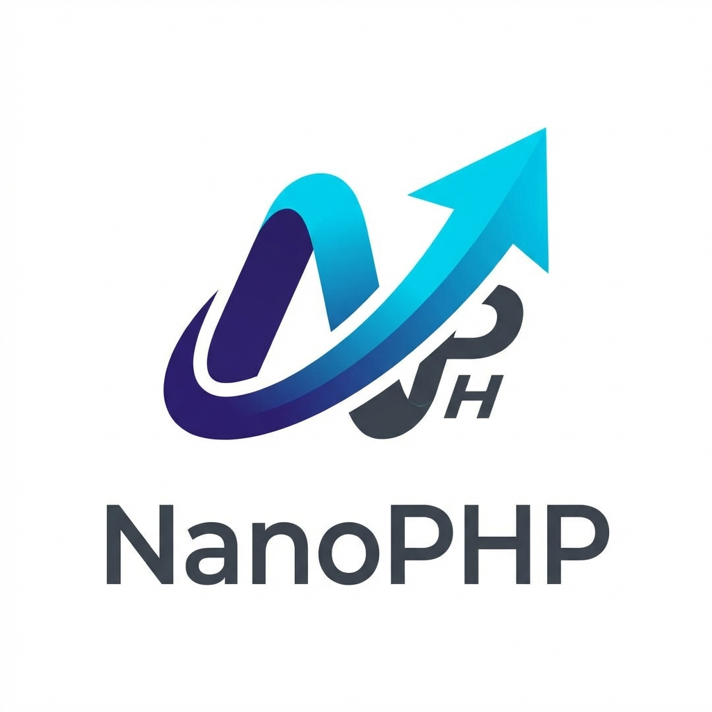

<p align="center">
  
</p>

<h1 align="center">NanoPHP</h1>

<p align="center">
  <strong>A lightweight, elegant PHP framework for modern web applications</strong>
</p>

<p align="center">
  <a href="https://github.com/ermradulsharma/nanophp/blob/main/LICENSE.md"></a>
  <a href="https://github.com/ermradulsharma/nanophp"></a>
</p>

---

## ✨ Features

NanoPHP combines the elegance of Laravel with the simplicity of a micro-framework, giving you the best of both worlds:

- 🎨 **Laravel-Inspired Architecture** - Familiar directory structure and conventions
- ⚡ **Blazing Fast** - Minimal overhead, maximum performance
- 🛠️ **Powerful CLI** - 50+ Artisan commands for rapid development
- 🎭 **Blade Templating** - Elegant, intuitive template engine
- 🔐 **Built-in Authentication** - Session-based auth with middleware support
- 📦 **Eloquent ORM** - Beautiful database interactions
- ⚙️ **Dependency Injection** - Clean, testable code with PHP-DI
- 🎯 **Modern Routing** - Fast route matching with middleware support
- 🎨 **Vite Integration** - Hot module replacement for React/Vue
- 📝 **Validation** - Powerful request validation
- 🗄️ **Database Migrations** - Version control for your database
- 📧 **Queue System** - Background job processing
- 🔍 **Logging** - Comprehensive error tracking

---

## 🚀 Quick Start

### Installation

```bash
composer create-project nanophp/nanophp my-project --stability=dev
cd my-project
```

### Configuration

```bash
# Copy environment file
cp .env.example .env

# Generate application key
php artisan key:generate

# Configure your database in .env
DB_CONNECTION=mysql
DB_HOST=127.0.0.1
DB_PORT=3306
DB_DATABASE=nanophp
DB_USERNAME=root
DB_PASSWORD=
```

### Run Development Server

```bash
# Start PHP server
php artisan serve

# In another terminal, start Vite
npm install
npm run dev
```

Visit `http://localhost:8000` and you're ready to go! 🎉

---

## 📁 Project Structure

```
nanophp/
├── app/
│   ├── Http/
│   │   ├── Controllers/    # Your application controllers
│   │   └── Middleware/     # Custom middleware
│   └── Models/             # Eloquent models
├── bootstrap/              # Framework bootstrap
├── config/                 # Configuration files
├── database/
│   ├── migrations/         # Database migrations
│   └── seeders/           # Database seeders
├── public/                # Public assets
├── resources/
│   ├── css/               # Stylesheets
│   ├── js/                # JavaScript (React/Vue)
│   └── views/             # Blade templates
├── routes/
│   └── web.php            # Web routes
├── storage/               # Logs, cache, compiled views
└── vendor/                # Composer dependencies
```

---

## 🎯 Usage Examples

### Creating a Controller

```bash
php artisan make:controller UserController
```

```php
<?php

namespace App\Http\Controllers;

use App\Models\User;
use Nano\Framework\Facades\View;

class UserController
{
    public function index()
    {
        $users = User::all();
        return View::render('users.index', ['users' => $users]);
    }
}
```

### Defining Routes

```php
// routes/web.php
use Nano\Framework\Facades\Route;

Route::get('/', 'App\Http\Controllers\HomeController@index');
Route::get('/users', 'App\Http\Controllers\UserController@index');

// Protected routes
Route::get('/dashboard', 'App\Http\Controllers\DashboardController@index')
    ->middleware('auth.middleware');
```

### Creating a Model

```bash
php artisan make:model Post --migration
```

```php
<?php

namespace App\Models;

use Illuminate\Database\Eloquent\Model;

class Post extends Model
{
    protected $fillable = ['title', 'content', 'user_id'];

    public function user()
    {
        return $this->belongsTo(User::class);
    }
}
```

### Using Blade Templates

```blade
<!-- resources/views/welcome.blade.php -->
<!DOCTYPE html>
<html>
<head>
    <title>{{ $title }}</title>
    @vite(['resources/css/app.css', 'resources/js/app.jsx'])
</head>
<body>
    <h1>Welcome to NanoPHP</h1>

    @if($user)
        <p>Hello, {{ $user->name }}!</p>
    @else
        <p>Please <a href="/login">login</a></p>
    @endif
</body>
</html>
```

---

## 🛠️ Available Commands

```bash
# Generate files
php artisan make:controller UserController
php artisan make:model Post
php artisan make:middleware CheckAge
php artisan make:migration create_posts_table

# Database
php artisan migrate
php artisan migrate:rollback
php artisan db:seed

# Authentication
php artisan make:auth

# Cache & Optimization
php artisan cache:clear
php artisan view:clear
php artisan config:cache

# Development
php artisan serve
php artisan tinker
```

---

## 📚 Documentation

For detailed documentation, visit our [Wiki](https://github.com/ermradulsharma/nanophp/wiki) (coming soon).

---

## 🤝 Contributing

Contributions are welcome! Please read our [Contributing Guide](CONTRIBUTING.md) for details.

1. Fork the repository
2. Create your feature branch (`git checkout -b feature/amazing-feature`)
3. Commit your changes (`git commit -m 'Add amazing feature'`)
4. Push to the branch (`git push origin feature/amazing-feature`)
5. Open a Pull Request

---

## 📄 License

NanoPHP is open-sourced software licensed under the [MIT license](LICENSE.md).

---

## 🙏 Credits

- **Inspired by [Laravel](https://laravel.com)** - For the elegant architecture and design patterns
- **Powered by [Illuminate Components](https://github.com/illuminate)** - Database, Validation, and Views
- **Built with**:
  - [PHP-DI](https://php-di.org/) - Dependency Injection
  - [FastRoute](https://github.com/nikic/FastRoute) - Routing
  - [Monolog](https://github.com/Seldaek/monolog) - Logging
  - [Vite](https://vitejs.dev/) - Frontend tooling

---

<p align="center">Made with ❤️ by <a href="https://github.com/ermradulsharma">Er. Mradul Sharma</a></p>
